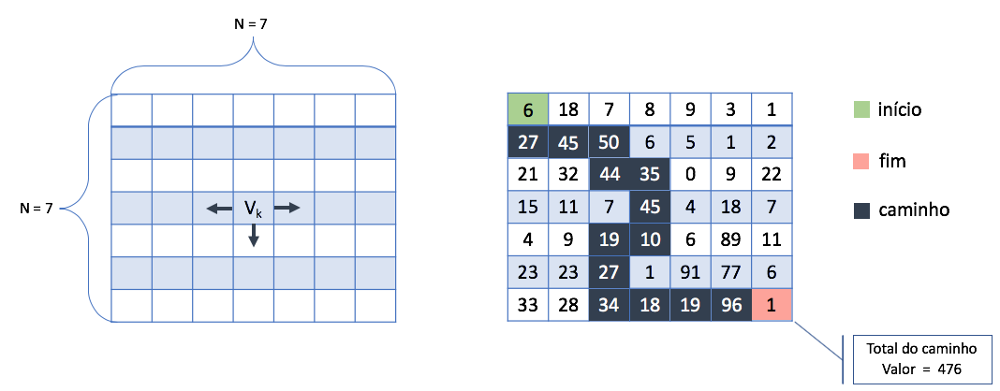

# Percorrendo matriz NxN: Implementação em C

1 - Preenche a matriz N x N com números inteiros aleatórios de 0 a 99;

2 - Considere a posição Linha 0 e Coluna 0 (0,0) como início;

3 - Considere a posição (N, N) como posição final;

4 - Percorra a matriz a partir do início, somando a cada passo, o próximo maior valor encontrado;

5 - O próximo valor pode ser o que está na mesma linha e imediatamente à direita, imediatamente à esquerda, bem como, o que está na coluna abaixo do numero corrente;

5.1 Há apenas uma exceção de percurso. Ao chegar na última linha deve-se percorre-la até o fim sem realizar mais migrações para colunas acima. 

6 - Andando na matriz conforme as regras acima, qual o maior caminho do início até o final, sabendo-se que a soma das posições representa o tamanho do caminho.

Observe um exemplo logo abaixo para uma matriz com N = 7.

 

	 

# Contatos

<a href="https://t.me/caio_fer_dias">
 

 

<a style="color:black" href="caio24092001@gmail.com?subject=[GitHub] Percorrendo matriz NxN: Implementação em C">
✉️ <i>caio24092001@gmail.com</i>
</a>
